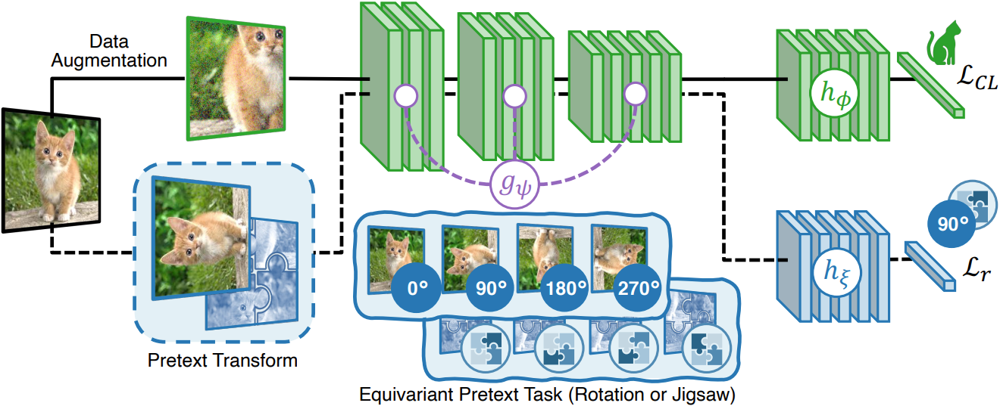

# On the Effectiveness of Equivariance Regularization for Robust Online Continual Learning

**Built on top of Mammoth - An Extendible (General) Continual Learning Framework for Pytorch**

## Before using
- Help:     `python utils/main.py --help`
- Install:  `pip install -r requirements.txt`

## Datasets
- Seq. CIFAR-100: `seq-cifar100-online`
- Seq. *mini*ImageNet: `seq-miniimg-online`. **WARNING**: the dataset needs to be downloaded by hand. You can use the following link: https://drive.google.com/file/d/1Ephas2PgPqzBM_JTcWYMWqYSsRuxfteE/view?usp=share_link

**Note**: by default the experiments are done in an online setting. To run the experiments in an offline setting, add the `--n_epochs` argument.
- *For example, `--n_epochs=30` for Seq. CIFAR-100 and `--n_epochs=50` for Seq. *mini*ImageNet.*

**ONLY FOR OnPro**
We follow the original implementation and add extra transforms to `onpro`. These are available using the `seq-cifar100-online-onpro` and `seq-miniimagenet-online-onpro` datasets.

## Models
- DualNet:  `dualnet`
- CoPE:     `cope`
- X-DER:    `xder`
- ER-ACE:   `er_ace`
- Joint:    `joint`
- Finetune: `sgd`
- LwF.MC:   `lwf`
- R-DFCIL:  `rdfcil`
- OnPro:    `onpro`

## Arguments

### Regularizations
- **CLER**: `<model name>_pretext`
    - requires `--ptx_alpha` (`lambda_r`)
    - (optional) `--pretext` (default: `jigsaw`, choices: [`rotation`, `jigsaw`]). Pretext task to use.
    - (if `jigsaw`) `--n_patches` (default: `4`, choices: [`4`, `9`, `16`]). Number of patches to split the image into.
    - (if `jigsaw`) `--max_permutations` (default: `100`). Maximum number of permutations to use for the jigsaw task.
- **CSSL**: `<model name>_cssl`
    - requires `--inv_alpha` (`lambda_r`)
    - `--selfsup` (default: `barlow`, choices: [`simclr`, `simsiam`, ` byol`, `barlow`, `mocov2`]). Contrastive-based method to use.
    - not available for `lwf`, `rdfcil`, and `onpro`.

*Note: Not available for SGD and Joint*

### Mandatory arguments
- `--dataset`
- `--model`
- `--buffer_size` (not available for `sgd`, `joint`, `lwf`, and `rdfcil`)
- `--lr`            

**Other arguments depend on the base model, see --help**

## Ex: Run ER-ACE + CLER

On Seq. CIFAR-100:
- `python utils/main.py --model=er_ace_pretext --dataset=seq-cifar100-online --lr=0.01 --buffer_size=500 --ptx_alpha=1.7 --pretext=jigsaw`
- `python utils/main.py --model=er_ace_pretext --dataset=seq-cifar100-online --lr=0.01 --buffer_size=2000 --ptx_alpha=1.5 --pretext=jigsaw`

On Seq. *mini*ImageNet:
- `python utils/main.py --model=er_ace_pretext --dataset=seq-miniimg-online --lr=0.03 --buffer_size=2000 --ptx_alpha=0.3 --pretext=rotation`
- `python utils/main.py --model=er_ace_pretext --dataset=seq-miniimg-online --lr=0.03 --buffer_size=8000 --ptx_alpha=1 --pretext=jigsaw`

